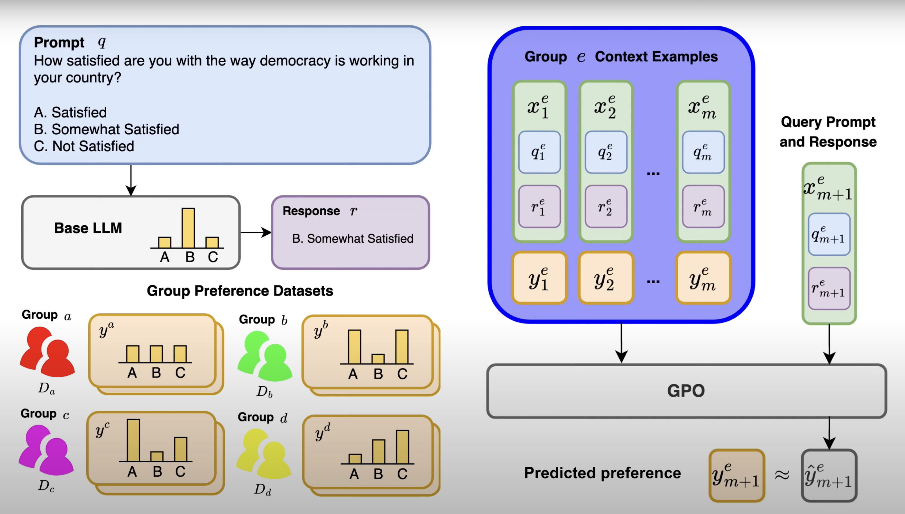

# Group Preference Optimization (GPO): Few-Shot Alignment of Large Language Models

[Website](https://siyan-zhao.github.io/llm-gpo/) | [Paper](https://arxiv.org/abs/2310.11523)



---

## Baselines:

### 1. Download Data 

- Download the data for the Opinion QA dataset [oqa](https://github.com/tatsu-lab/opinions_qa).
- Compute the human and LM opinion distributions using their [notebook](https://github.com/tatsu-lab/opinions_qa/blob/main/process_results.ipynb).

Ensure your directory has this structure:

- QQA_data/
    - distributions/
    - OpinionsQA/
        - human_resp/
        - model_input/
        - runs/


Update the `data.oqa_datapath` in the following configuration files:
- `train_incontextft.yaml`
- `train_sft.yaml`
- `train_regress_rm.yaml`
- `baseline.yaml`

Also, set the `model_ckpt` in the above files to your language model.

### 2. Evaluate Baseline Model Opinions Alignment

- Modify the model and dataset configurations in `baselines/configs/baseline.yaml`.
- Execute: ``python eval_basemodel.py``

### 3. Obtain Few-shot Prompting Results

- Modify the `eval_n_ctx_qs` in `baselines/configs/baseline.yaml`.
- Execute: ``python eval_basemodel_fewshot.py``

### 4. Train SFT-LM

- Modify the parameters in `baselines/configs/train_sft.yaml`.
- Execute: ``python train_sft.py``


### 5. Train In-context Finetuning

- Modify the parameters in `baselines/configs/train_incontextft.yaml`.
- Execute: ``python train_ctx_finetune.py``


---

## GPO Training:

### 1. Cache Question Embeddings

Ensure you cache your question embeddings before proceeding to the training step.
modify the embedding model and the dataset in `baselines/get_emb/embedding.yaml` and run ``python get_embeds.py``

### 2. Train GPO

Train GPO: ``python train_gpo.py``

---

**Citation**: If our implementation proves valuable for your work, kindly consider citing us.


```
@article{zhao2023group,
  title={Group preference optimization: Few-shot alignment of large language models},
  author={Zhao, Siyan and Dang, John and Grover, Aditya},
  journal={arXiv preprint arXiv:2310.11523},
  year={2023}
}
```


